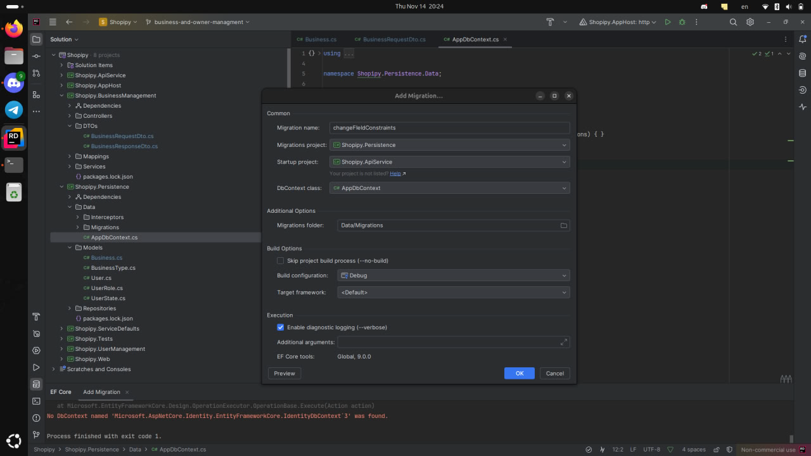

## .proj file
When you create a new project for your feature, you need to include `Shopipy.Persistence` project in your new project.
Add this to your `Shopipy.NewFeature.csproj` file
```xml
<ItemGroup>
    <ProjectReference Include="..\Shopipy.Persistence\Shopipy.Persistence.csproj" />
</ItemGroup> 
 ```

## Migrations
After modifying your model, you should create a migration. You can do this via the terminal or a GUI.

Main points:
- Specify the migration project `Shopipy.Persistence/Shopipy.Persistence.csproj`
- Specify the startup project: `Shopipy.ApiService/Shopipy.ApiService.csproj`
- Specify the output directory `Data/Migrations`

Example command:
```shell
dotnet ef migrations add --project Shopipy.Persistence/Shopipy.Persistence.csproj --startup-project Shopipy.ApiService/Shopipy.ApiService.csproj --context Shopipy.Persistence.Data.AppDbContext --configuration Debug --verbose {migrationName} --output-dir Data/Migrations
```
Rider IDE gui example:


On startup, Shopipy.AppHost will automatically apply migrations.

## Repositories
A generic CRUD repository has already been implemented. There is no need to create a custom `StuffRepository`. If you need one, simply inject `GenericRepository<Stuff>`. See how it’s implemented in `BusinessManagement.`

